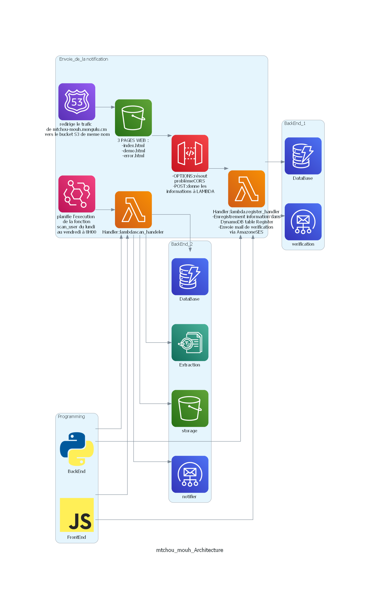

# Mtchoun' mouh
> [Ghomala](https://fr.wikipedia.org/wiki/Ghomala%CA%BC) language meaning news/message in French

[](#contributors-) 

[](http://commitizen.github.io/cz-cli/)


The goal of the project is to allow you to review a notification immediately after your passport is issued at the consulate in Marseille, France.
If you want to see what it looks like, go to: https://mtchoun-mouh.mongulu.cm/

## Functional context

### Current behavior

When a user goes to the Cameroonian Consulate in Marseille to apply for a passport, he is reminded that in order to know if his passport has been issued, he must regularly look at a page on the [consulate] website (https://www.consulacam-marseille.fr/index.php?p=consulat-cameroun-passeports). This page contains all the passport arrival notices in chronological order, beginning with the mention **Passport arrival notice of the dd month year** .
You have to scroll through this page from the beginning to a release date later than the filing date. The reason is that these are images and not published text; it is therefore impossible to use the browser's search function.

### Problem

* The person who has applied at the consulate, even if he or she has a vague idea of how long it will take, will nevertheless have to check the website regularly to see if it is out or not. It is therefore necessary to keep it in the back of one's mind.

* Once on the site, even if she is helped by the fact that the communiqués are arranged chronologically, she must nevertheless browse the communiqués subsequent to her application to see if hers is out. A mistake can happen quickly if you are not concentrated.

### Proposed solution
The user registers on a platform via his name and email address which will then allow to notify him
automatically notified by email of the release of his passport with the following constraints:
    - No access to the digitalized information system of passport management of the [DGSN] (https://www.dgsn.cm/?fbclid=IwAR1KmGe-drUBiwpUg_tx-6b-crEPsXrqoPdTK7X8Ik-mag-NG7pUky4zV7U)
    - No possibility to influence the internal process of passport issuance at the consulate of Marseille

> The solution will therefore be external to the Consulate's services and the data source will be the Consulate's website.


## Technical context

If you are here, it means that you are interested in an in-house deployment of the solution. Follow the guide :) !

### Architecture

<details><summary>Click on the arrow to view </summary>



</details>


### Prerequisites

* Have a minimum of competence on the AWS and Terraform cloud
* Install all tools locally (just run the `init` and `command` scripts in the [.gitpod.yml] file (.gitpod.yml) **or** use a ready-made development environment on gitpod :

[](https://gitpod.io/#https://github.com/mongulu-cm/mtchoun-mouh)


### Deployment

* Create a `.env` file in the root containing:
  ```
    export TF_VAR_MAINTAINER_MAIL="<votre mail>"
    export TF_VAR_WEBSITE_BUCKET_NAME="<votre sous-domaine>.<domaine>"
    export TF_VAR_IMAGES_BUCKET_NAME="xxxxxxx"
  ```

* Then run the following commands:
  ```
    source .env
    cd infra/
    terraform init
    terraform apply
    aws s3 cp ../html/ s3://${TF_VAR_WEBSITE_BUCKET_NAME}.mongulu.cm --recursive
  ```

* Finally, create a cloudfront distribution and DNS record ${TF_VAR_WEBSITE_BUCKET_NAME}.xxxx.yyy pointing to it

### Pyramid test

#### Unit tests
  ```
    cd api/
    pytest test_extract.py
    pytest test_notify.py
  ```

#### Integration tests

To launch integration tests locally :
  ```
    act -j <job_name> --secret-file .env
  ```

#### End to end


### Application monitoring

The API Gateway and Lambda services save logs in CloudWatch.   
The tracking of the visits on the website is done with https://fr.matomo.org/ (opensource alternative to Google Analytics).

### Application performance

It is possible to track the evolution of the number of registered users per day by exploiting the
`ReturnedItemCount` parameter of the `Register` table in Cloudwatch DynamoDB graphs.

## How to contribute ?

You noticed a problem, or you want to suggest an improvement ? Do not hesitate to open an issue :) !

## Contributors ✨

Thanks goes to these wonderful people ([emoji key](https://allcontributors.org/docs/en/emoji-key)):

<!-- ALL-CONTRIBUTORS-LIST:START - Do not remove or modify this section -->
<!-- prettier-ignore-start -->
<!-- markdownlint-disable -->
<table>
  <tr>
    <td align="center"><a href="https://github.com/fabiolatagne97"><br /><sub><b>fabiolatagne97</b></sub></a><br /><a href="https://github.com/mongulu-cm/mtchoun-mouh/commits?author=fabiolatagne97" title="Tests">⚠️</a> <a href="https://github.com/mongulu-cm/mtchoun-mouh/commits?author=fabiolatagne97" title="Code">💻</a> <a href="#design-fabiolatagne97" title="Design">🎨</a></td>
  </tr>
</table>

<!-- markdownlint-restore -->
<!-- prettier-ignore-end -->

<!-- ALL-CONTRIBUTORS-LIST:END -->

This project follows the [all-contributors](https://github.com/all-contributors/all-contributors) specification. Contributions of any kind welcome!