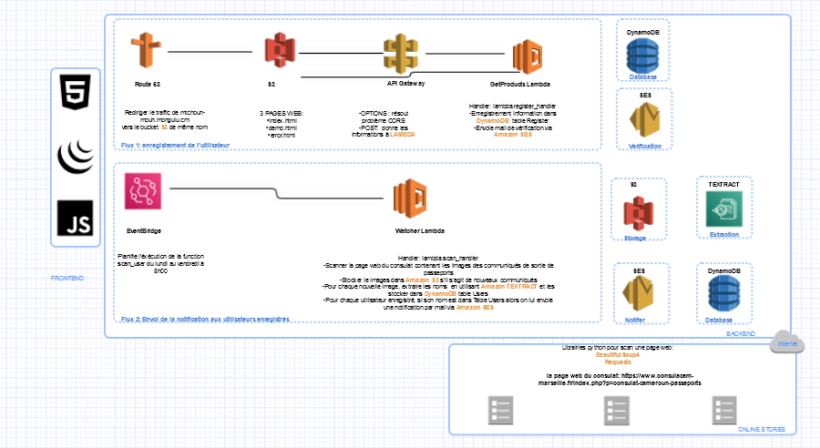

# Mtchoun' mouh
> Langue [Ghomala](https://fr.wikipedia.org/wiki/Ghomala%CA%BC) siginifiant nouvelle/message en français

L'objectif du projet est de vous permettre de revoir une notification immédiatement après la sortie de votre passeport au consulat de Marseille en France.  
Si vous souhaitez voir à quoi ça ressemble, rendez-vous à l'adresse suivante: https://mtchoun-mouh.mongulu.cm/

## Contexte fonctionnel

### Comportement actuel

Lorsqu'un usager se rend au consulat du Cameroun à Marseille pour faire sa demande au consulat, il lui est rappelé que pour savoir si son passeport est sorti , il lui faut régulièrement regarder une page du site du [consulat](https://www.consulacam-marseille.fr/index.php?p=consulat-cameroun-passeports). En effet cette page contient tous les communiqués d’arrivée de passeport ordonnées de façon chronologique et débutant par la mention  **Communiqué du dd month year** .  
Il faut alors parcourir cette page depuis le début en scrollant jusqu'à une date de communiqué ultérieure à la date de dépôt. C'est qu'il s’agit d’images et non de texte publiés ;impossible donc d’utiliser la fonction de recherche du navigateur.

### Problèmes

* La personne qui a fait sa demande au consulat même si elle peut avoir une vague idée du temps que cela prendra devra néanmoins régulièrement checker le site web pour savoir si celui-ci est sorti ou pas. Il faut donc qu’elle se le garde dans un coin de sa tête.

* Une fois sur le site, même si elle est aidé par le fait que les communiqués sont rangés chronologiquement, elle doit néanmoins parcourir les communiqués ultérieurs à sa demande de visa pour voir si le sien est sorti. Une erreur est donc vite arrivé si l’on est pas concentré . 

### Solution proposé
L'usager s'enregistre sur une plateforme via son nom et son adresse email ce qui permettra ensuite de le notifier  
automatiquement notifié par email de la sortie de son passeport avec les contraintes suivantes:   
    • Pas d’accès au système d’information digitalisé de gestions des passeports de la [DGSN]( https://www.dgsn.cm/?fbclid=IwAR1KmGe-drUBiwpUg_tx-6b-crEPsXrqoPdTK7X8Ik-mag-NG7pUky4zV7U)    
    • Pas de possibilité d’influer sur le processus interne de délivrance des passeports au consulat de Marseille
    
> La solution sera donc externe au services du consulat et la source de donnée le site web du consulat. 


## Contexte technique

Si vous êtes ici , c'est que vous intéressés par un déploiement maison de la solution. Suivez le guide :) !

### Prérequis
Vous devez avoir un minimum de compétence sur le cloud AWS et Terraform

Sur le cloud AWS:
* Disposez d'un IAM User avec les permissions d'écriture/lecture sur les services: Lambda, S3, API Gateway, IAM ( ce  
sera le compte utilisé par Terraform)
* Disposez d'un IAM Role appelé website-deployer associé au service Lambda et qui possède les droits écriture/lecture 
sur les services: S3, DynamoDB, Textract, SES, Cloudwatch
* Permettre de sauvegarder le logs d'erreur API Gateway dans Cloudwatch: https://www.youtube.com/watch?v=N49Bp_bd93I
* Avoir enregistré votre domaine xxxx.yyy ainsi que le sous-domaine mtchoun-mouh.xxxx.yyy dans Route 53
> Si vous souhaitez utiliser un nom de domaine gratuitement, sachez que les .ml (mali) et bien d'autres sont gratuits.
> Pour plus d'information ou réservation: http://www.freenom.com/en/freeandpaiddomains.html
* Avoir généré un certificat SSL wildcard pour votre domaine xxxx.yyy dans AWS Certificate Manager
> Le certificat est généré gratuitement dans AWS CM



Sur votre poste : 
* terraform/v0.13.2
* aws-cli
* git
* docker
* zip
* Google Chrome
* uirecorder: https://github.com/alibaba/uirecorder  
* Java: https://java.com/fr/download/  
* Un fork de ce ce projet

Sur le web:
* Disposer d'un compte sur https://gitreports.com/ et activez votre fork.


### Déploiement

* Créez un fichier `.env` à la racine contenant:
  ```
    export TF_VAR_maintainer_mail="<votre mail>"
    export TF_VAR_website_bucket_name="<votre sous-domaine>"
    export TF_VAR_redirect_bucket_name="<votre domaine>"
    export TF_VAR_images_bucket_name="xxxxxxx"
    export TF_VAR_contact_url="votre lien view généré sur gitreports.com"
  ```    
    
* Ensuite, éxécutez les commandes suivantes:
  ```
    source .env
    terraform init
    terraform apply
  ```
 
* Puis, créez une distribution cloudfront:  
    • ayant comme origine le nom de site de votre bucket ( pas le nom du bucket)    
    • pointant vers votre sous-domaine mtchoun-mouh.xxxx.yyy  
    • avec des caches invalidations pour les fichiers index.html et demo.html
    
 
* Et enfin deux enregistrements DNS dans Route 53:  
    • L'un reliant le domaine xxxx.yyyy au sous-domaine mtchoun-mouh.xxxx.yyy  
    • L'autre reliant mtchoun-mouh.xxxx.yyy à la distribution cloudfront créé précédemment


### Pyramid test

#### Unit tests
TODO

#### Integration tests
TODO

#### End to end

Ce test vérifie qu'un utilisateur utilisant un PC arrive bien à s'enregistrer ( en supposant qu'il rentre tous les
paramètres comme il faut).

* Initialisation du test & démarrage du server selenium standalone :
  ```
    cd test/
    uirecorder init
    npx selenium-standalone start
  ```

* Exécutez le test en mode PC:
  ```
     cd test/
     .\run.bat sample/test.spec.js (windows) or source run.sh sample/test.spec.js (Linux/Mac)
  ```

Les résultats sont visibles dans le CLI ou dans reports/html

### Monitoring applicatif

Les services API Gateway et Lambda sauvent des logs dans CloudWatch.

### Performance applicative

Il est possible de suivre l'évolution du nombre d'utilisateur enregistré par jour en exploitant le paramètre
`ReturnedItemCount` de la table `Register` dans les graphiques Cloudwatch DynamoDB.


## Comment contribuer ?

Vous avez remarqué un soucis ou vous voulez proposer une amélioration ? N'hésitez pas à ouvrir une issue :) !
